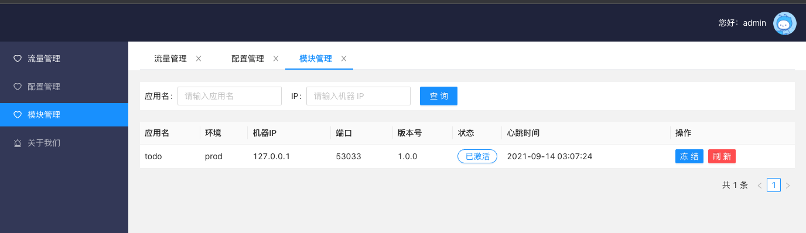
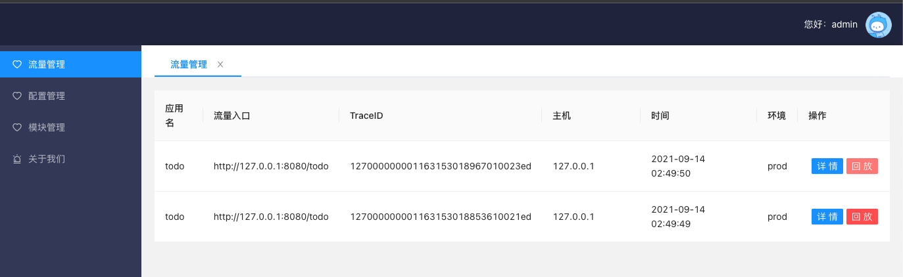
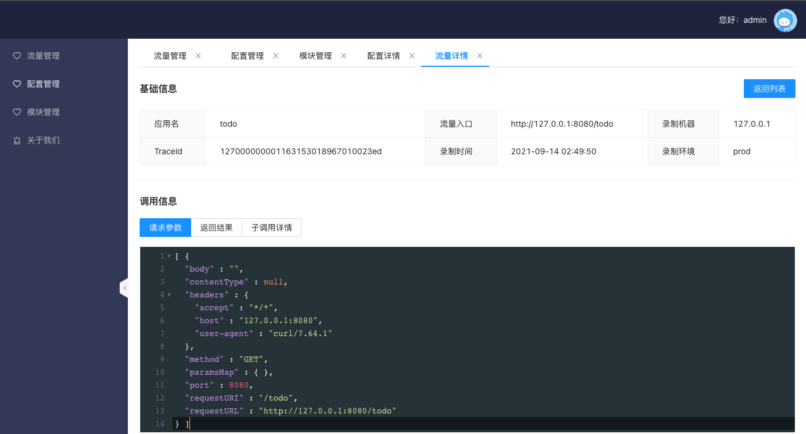
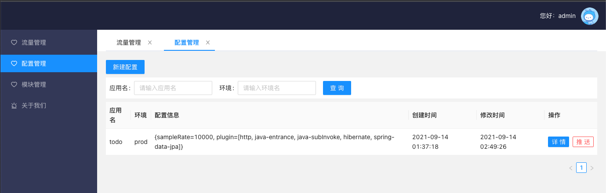

# JVM-Sandbox-Repeater Web UI

基于 React + TypeScript + Ant-Design

## 更改的JVM-Sandbox-Repeater 仓库

[JVM-Sandbox-Repeater](https://github.com/daviyang35/jvm-sandbox-repeater)

主要是将请求响应为JSON。

## TODO

- [x] 流量管理-列表
- [x] 流量管理-详情页
- [ ] 流量管理-回放按钮
- [ ] 流量管理-回放结果

---

- [x] 配置管理-列表
- [x] 配置管理-详情：仅可预览，保存未完成
- [x] 配置管理-推送
- [x] 配置管理-条件搜索
- [ ] 配置管理-新建配置
- [ ] 配置管理-编辑器优化：JSON验证

---

- [x] 模块管理-列表
- [x] 模块管理-冻结
- [x] 模块管理-刷新
- [x] 模块管理-条件搜索

---

- [ ] 更换 react-app-rewired 为 craco

## Preview

